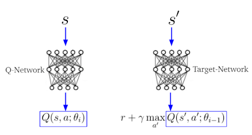

# Reinforcement Learning with ATARI Games

## Overview

This repository implements Reinforcement Learning (RL) algorithms for playing ATARI games using OpenAI Gym and Stable-Baselines3. RL is a machine learning paradigm where agents learn to make decisions by interacting with an environment. ATARI games serve as benchmark environments, and this repository provides implementations of popular RL algorithms for playing these games.

## Structure Of Algorithm

-

## Results

Our RL agents have been trained and evaluated on a variety of ATARI games, demonstrating their learning capabilities. Here are some key results:

- **Double Q-Network (Double DQN)**
  - Achieved remarkable performance on games such as Space Invaders and Breakout.
  - Surpasses human-level performance, with scores consistently exceeding 50% of the top 10% of human benchmarks.

